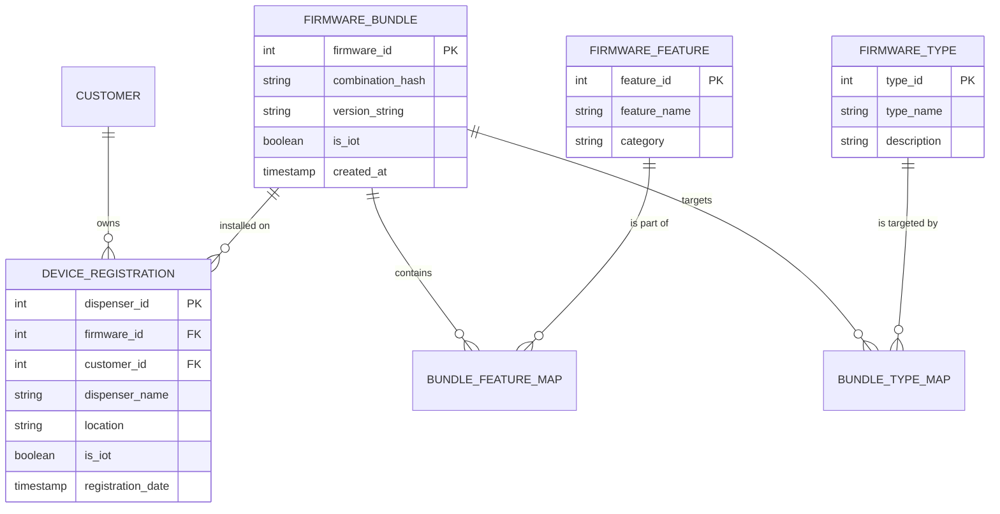

# ⛽ Dispenser Registration Portal

A production-ready management system for fuel dispenser firmware registration, device deployment, and customer tracking. Built with a focus on visual excellence, security, and flexible firmware versioning.

---

## 🚀 Overview

The **Dispenser Registration Portal** provides a centralized interface for LIPL Systems to manage the complex lifecycle of fuel dispenser firmware. It allows administrators to define modular firmware features, group them into versioned bundles, and register hardware deployments with specific compatibility checks.

### Key Capabilities:
- **Modular Firmware Bundling**: Compose firmware from various types (GSM, MB, Display) and features (WiFi, BLE, OTA).
- **IoT-Aware Provisioning**: Enforce strict logic to keep non-IoT hardware simple by automatically stripping modular features.
- **Premium User Experience**: A sleek, high-performance light theme with glassmorphism and real-time validation.
- **Live Monitoring**: Dashboard analytics for registered devices and firmware distribution.

---

## 🛠️ Tech Stack

- **Backend**: [Node.js](https://nodejs.org/) & [Express](https://expressjs.com/)
- **Database**: [PostgreSQL](https://www.postgresql.org/)
- **Frontend**: Vanilla HTML5, CSS3 (Custom Design System), and ES6+ JavaScript.
- **Styling**: Premium Light Mode with HSL color tokens and CSS variables.

---

## 📊 Database Architecture

The system uses a relational schema designed for flexibility and referential integrity.



---

## ✨ Key Features

### 1. IoT Validation Logic
The system distinguishes between **IoT-enabled** and **Standard** devices.
- **IoT Bundles**: Support modular features like WiFi, GPS, and Data Logging.
- **Standard Bundles**: Automatically cleared of features to prevent bloat on basic hardware.
- **Compatibility Control**: During device registration, the portal dynamically filters available firmware bundles to ensure only compatible versions are selected.

### 2. Premium Light Mode
Designed for high visibility and professional use:
- **Glassmorphism**: Translucent card backgrounds and blurred header backdrops.
- **Design Tokens**: Centralized CSS variables in `:root` for consistent typography and spacing.
- **Micro-animations**: Subtle transitions for sidebar navigation and form interactions.

---

## 🔌 API Reference

### Dashboard
- `GET /api/dashboard`: Summary stats for the entire system.

### Firmware Management
- `GET /api/firmware-types`: List all hardware types.
- `POST /api/firmware-types`: Add new hardware module type.
- `GET /api/firmware-features`: List available modular features.
- `POST /api/firmware-features`: Define new firmware capabilities.
- `GET /api/firmware-bundles`: Get all versioned bundles with enriched feature/type data.
- `POST /api/firmware-bundles`: Create a feature combination with auto-generated hash.

### Registration
- `GET /api/customers`: List all clients.
- `POST /api/customers`: Add new petrol pump/client records.
- `GET /api/devices`: Get all registered dispenser deployments.
- `POST /api/devices`: Register a new device with hardware IDs and location data.

---

## ⚙️ Installation & Setup

### 1. Prerequisites
- [Node.js](https://nodejs.org/) (v16.x or higher)
- [PostgreSQL](https://www.postgresql.org/)

### 2. Environment Configuration
Create a `.env` file in the root directory:
```env
PORT=3000
DB_HOST=localhost
DB_PORT=5432
DB_USER=postgres
DB_PASS=your_password
DB_NAME=dispenser_registration
```

### 3. Database Initialization
Run the initialization script to create tables and seed samples:
```bash
npm run init-db
```

### 4. Running the Application
Start the development server with nodemon:
```bash
npm run dev
```
The portal will be available at `http://localhost:3000`.

---

## 📁 Project Structure
```text
├── public/                 # Frontend assets
│   ├── index.html          # Main application UI
│   ├── style.css           # Premium design system
│   └── app.js              # Frontend logic & API handlers
├── server.js               # Express application & API routes
├── database.js             # PostgreSQL connection pool
├── init_db.js              # Schema & Database initializer
├── .env                    # Environment variables
└── package.json            # Dependencies & Scripts
```

---

## 🛡️ License
Proprietary documentation for LIPL Systems.
